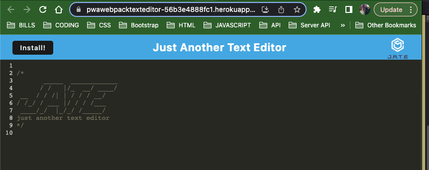
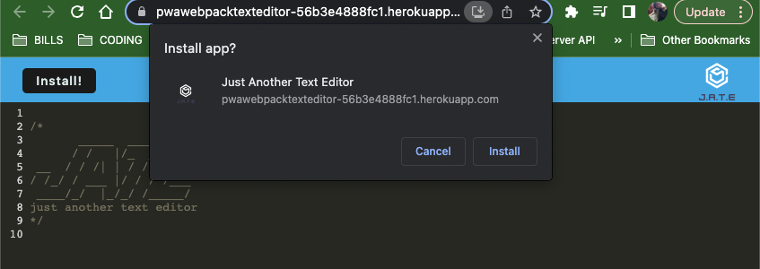

# PWA-webpack-text-editor

Progressive Web Applications - Webpack - Text Editor

Github: https://github.com/minutemin/PWA-webpack-text-editor

Heroku Live Deployment: https://pwawebpacktexteditor-56b3e4888fc1.herokuapp.com/

## Table of Contents (Optional)

If your README is long, add a table of contents to make it easy for users to find what they need.

- [Description](#description)
- [Installation](#installation)
- [Usage](#usage)
- [License](#license)

## Description

As a developer, I want to create a simple text editor that is a single-page app that features web bundling using webpack, service worker, and the indexedDB API.  Objective is to build a PWA that can save into indexed DB once outside of the DOM, and also have the app installable on desktop and have it functional when offline. 

## Installation
  
No installation needed to use the app off heroku, but if you want to download the app onto your desktop, click on the install button in the top left corner and it will download the app. 

## Usage

To use the app, go to the heroku link. There the text editor will appear and you can enter your code and it will save, only if you click on another windown or outside the current DOM. The same will work with the desktop version as well, they are both saved into the indexedDB. 

## License

Please refer to the link below if you need to read the terms and conditions of the license:
* [MIT license](https://choosealicense.com/licenses/mit/)

